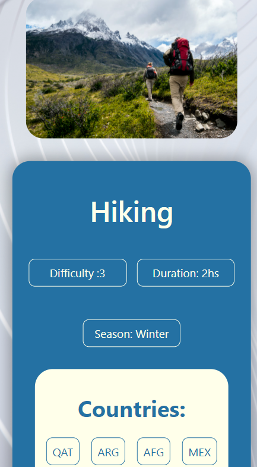

# GlobalProyect
### Responsive single page application.
#### This proyect was designed using React, sequelize, express, redux, only css, supertest and mocha.

It consists of 6 differents routes:

* Landing page '/': Introduction into the proyect and its tecnologies.
<pre>
#### Desktop view:
 
#### Mobile view:

</pre>

* Home '/home': Display of all the countries in the world. Filters to sort the countries based on name, population and/or continent. 
  Searchbar for searching specific countries. Pagination for easy navigation.
<pre>
#### Desktop view:
 
#### Mobile view:

</pre>

* Country detail '/home/:id': Detail of an specific country, displaying more information about the country and its associated activities.
<pre>
#### Desktop view:
 
#### Mobile view:

</pre>

* Create activity '/home/createActivity': Controlled form to create touristic activities in the desired countries.
<pre>
#### Desktop view:

#### Mobile view:

</pre>

* Activities '/home/activities': Display of all the created activities in the database. Pagination for practical navigation.
<pre>
#### Desktop view:
 
#### Mobile view:

</pre>

* Activity detail '/home/activities/:activityId': Detail of an specific activity with all the information and the associated countries.
<pre>
#### Desktop view:
 
#### Mobile view:

</pre>

The countries data was extracted from the API ('https://restcountries.com/v3/all') and modified for practical uses.
The database recieves this data and creates all the countries in the Country table. 
The activities get loaded into the database in the Activity table.
The relation between Country and Activity is many to many, in the CountryActivity table.

The models and server request are fully tested using mocha.
The react components are tested using supertest.
