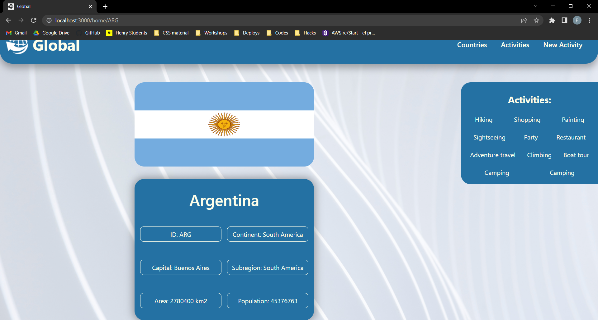
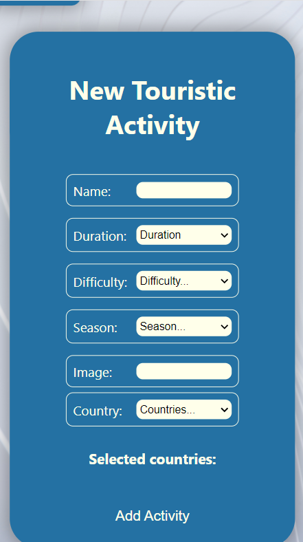

# GlobalProyect
### Fully  responsive single page application.
#### Global proyect is designed using React, sequelize, express, redux, only css, supertest and mocha.

## Views

Global's views consists of 6 differents routes:

* Landing page '/': Introduction into the proyect and its tecnologies.

### Desktop view:


### Mobile view:


* Home '/home': Display of all the countries in the world. Filters to sort the countries based on name, population and/or continent. 
  Searchbar for searching specific countries. Pagination for easy navigation.

### Desktop view:
 

### Mobile view:
   


* Country detail '/home/:id': Detail of an specific country, displaying more information about the country and its associated activities.

### Desktop view:
 

### Mobile view:
  


* Create activity '/home/createActivity': Controlled form to create touristic activities in the desired countries.

### Desktop view:
 

### Mobile view:
  


* Activities '/home/activities': Display of all the created activities in the database. Pagination for practical navigation.

### Desktop view:


### Mobile view:


* Activity detail '/home/activities/:activityId': Detail of an specific activity with all the information and the associated countries.

### Desktop view:
 

### Mobile view:


The countries data was extracted from the [API](https://restcountries.com/v3/all) and modified for practical uses.
The database recieves this data and creates all the countries in the Country table. 
The activities get loaded into the database in the Activity table.
The relation between Country and Activity is many to many, in the CountryActivity table.

The models and server request are fully tested using mocha.
The react components are tested using supertest.

## How to use

- First of all, you will need to have text editor ([VScode](https://code.visualstudio.com/download) recomended). 
- Then install [Git](https://git-scm.com/) and [Node.js](https://nodejs.org/en/download/). If you have averything ready then open VScode and run in the terminal:

```bash
# Clone this repository
$ git clone https://github.com/Facundo-Romano/GlobalProyect.git
```

- Inside the api folder, you will need to create a file named ".env" like this:

    DB_USER=
    DB_PASSWORD=
    DB_HOST=
    
- You will need to have PostgreSQL installed (learn how [here](https://www.guru99.com/download-install-postgresql.html)).
- If you already have PostgrSQL, create a new database called countries (learn how [here](https://www.guru99.com/postgresql-create-database.html), tip: scroll down to the section: Create Database using pgAdmin, it is the easier one.).
- Inside your .env file complete DB_USER with your postgreSQL user and DB_PASSWORD with your postgreSQL password. Complete DB_HOST with localhost. 


- Now that everything is completed you can start the app. In the terminal run the following commands:

```bash
# Go into the api folder
$ cd api
# Install dependencies
$ npm install
# Run the backend
$ npm start
# Open new terminal
$ cd client
# Install dependencies
$ npm install
# Run the frontend
$ npm start
```
